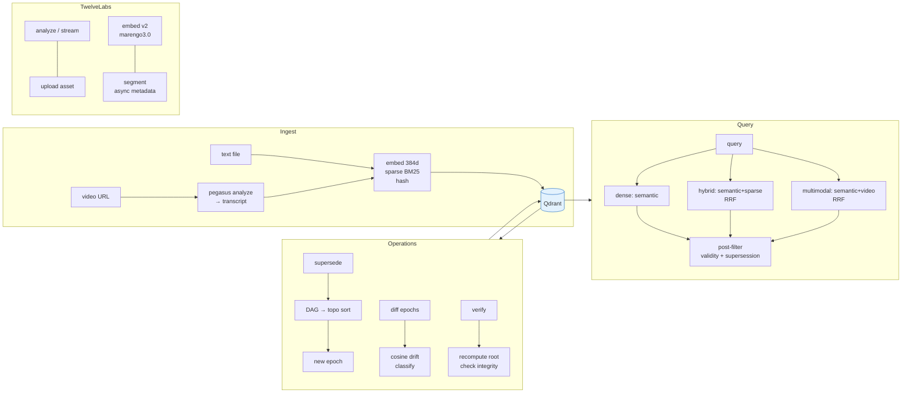
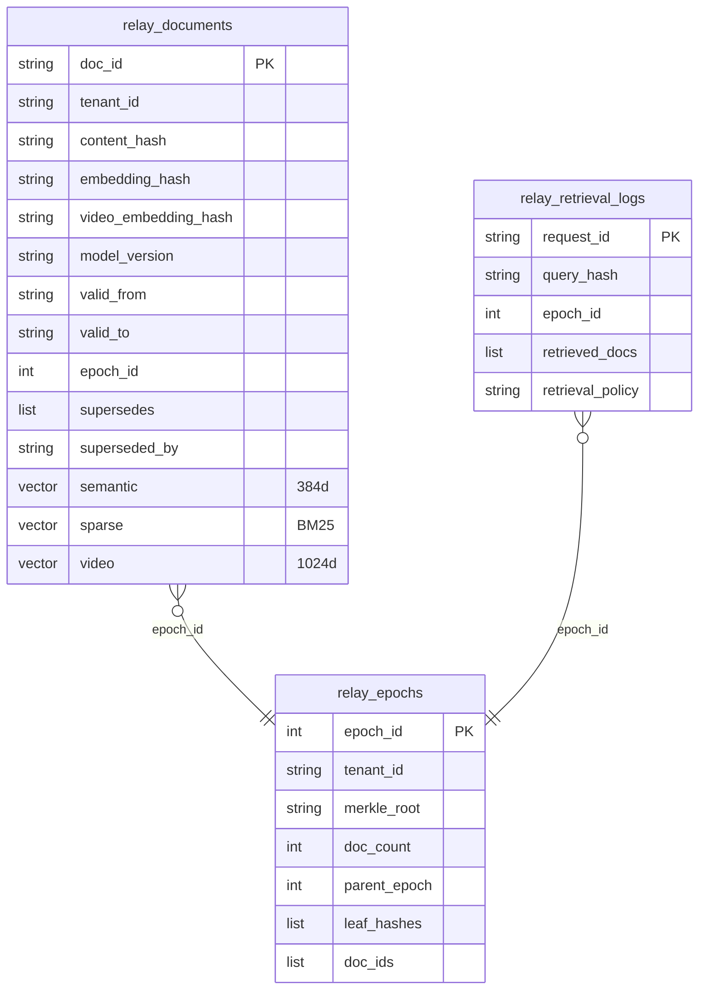
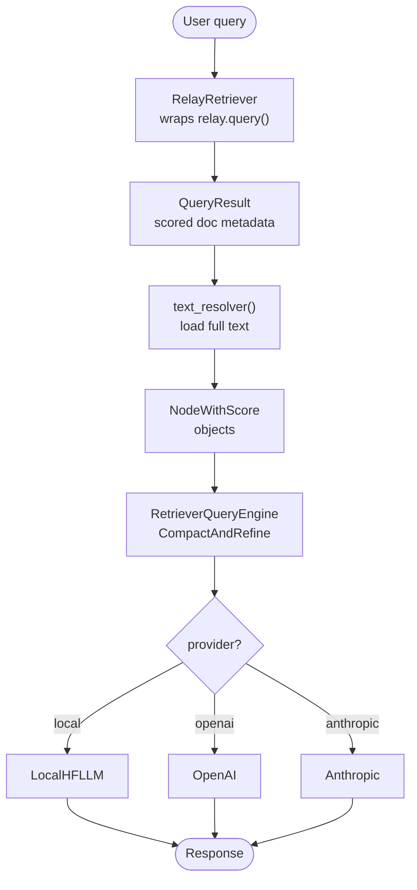

# Relay
**Version Control for Semantic Search** 

Relay is a temporal semantic memory system that transforms vector retrieval from a mutable, stateless semantic cache into a versioned, reproducible semantic memory infrastructure with full multimodal video understanding via TwelveLabs and LlamaIndex-powered RAG.

## Architecture

### High Level Design



### Full Lifecycle Sequence

```mermaid
sequenceDiagram
    actor U as User
    participant CLI as relay CLI
    participant EMB as Embeddings
    participant MK as Merkle
    participant QD as Qdrant
    participant TL as TwelveLabs API
    participant LLM as LLM Provider

    Note over U,LLM: Phase 1 — Ingest Text Document
    U->>CLI: relay ingest --file kafka.md --valid-from 2024-01-01
    CLI->>CLI: read file → text
    CLI->>EMB: content_hash = SHA256(text)
    CLI->>EMB: embed(text) → 384d semantic
    CLI->>EMB: embedding_hash = SHA256(vector)
    CLI->>EMB: sparse_embed(text) → BM25 indices+values
    CLI->>CLI: generate doc_id, epoch_id = count+1
    CLI->>QD: upsert PointStruct{semantic, sparse, payload}
    CLI->>MK: compute_leaf(doc_id ‖ hashes ‖ validity)
    CLI->>MK: compute_merkle_root([leaf])
    CLI->>QD: upsert epoch{merkle_root, leaf_hashes}
    CLI-->>U: IngestResult{doc_id, epoch=1, root}

    Note over U,LLM: Phase 2 — Ingest Second Document
    U->>CLI: relay ingest --file nats.md --valid-from 2025-01-01
    CLI->>EMB: content_hash + embed + embedding_hash + sparse_embed
    CLI->>QD: upsert PointStruct
    CLI->>MK: compute_leaf → compute_merkle_root
    CLI->>QD: upsert epoch
    CLI-->>U: IngestResult{doc_id, epoch=2, root}

    Note over U,LLM: Phase 3 — Supersede Document
    U->>CLI: relay supersede --old-doc kafka.md --new-doc nats.md
    CLI->>QD: scroll → find old doc + new doc (with vectors)
    CLI->>CLI: copy old{superseded_by=new, valid_to=today}
    CLI->>CLI: copy new{supersedes=[old_id]}
    CLI->>MK: build supersession DAG → topological sort
    CLI->>MK: compute leaf hashes in topo order
    CLI->>QD: upsert both copies in new epoch
    CLI->>MK: compute_merkle_root(ordered leaves)
    CLI->>QD: upsert epoch{root, leaves, doc_ids}
    CLI-->>U: SupersedeResult{epoch=3, root}

    Note over U,LLM: Phase 4 — Dense Query (default)
    U->>CLI: relay query --text "event streaming" --tenant payments
    CLI->>QD: get_current_epoch_id → latest epoch
    CLI->>EMB: embed(query) → 384d
    CLI->>QD: query_points(using=semantic, filter: tenant+epoch)
    QD-->>CLI: scored results ordered by cosine
    CLI->>CLI: post-filter: validity window + supersession
    CLI->>QD: upsert retrieval log{query_hash, docs, epoch, policy=dense}
    CLI-->>U: QueryResult{nats.md, score=0.91}

    Note over U,LLM: Phase 5 — Time-Travel Query
    U->>CLI: relay query --text "event bus" --at 2024-06-01
    CLI->>QD: resolve_epoch_at → latest epoch (partition key)
    CLI->>EMB: embed(query) → 384d (lru_cache hit)
    CLI->>QD: query_points(semantic, filter: tenant+epoch)
    QD-->>CLI: scored results
    CLI->>CLI: post-filter: valid_from ≤ 2024-06-01, valid_to > 2024-06-01, not superseded
    CLI->>QD: log retrieval
    CLI-->>U: QueryResult{kafka.md only — nats not yet valid}

    Note over U,LLM: Phase 6 — Epoch-Pinned Query
    U->>CLI: relay query --text "event bus" --epoch 1
    CLI->>QD: get_epoch(1) → exact epoch
    CLI->>EMB: embed(query) → 384d
    CLI->>QD: query_points(semantic, filter: tenant + epoch=1)
    QD-->>CLI: only epoch-1 documents
    CLI->>QD: log retrieval
    CLI-->>U: QueryResult{kafka.md, deterministic replay}

    Note over U,LLM: Phase 7 — Hybrid Query (dense + sparse RRF)
    U->>CLI: relay query --text "event bus" --retrieval-policy hybrid
    CLI->>EMB: embed(query) → 384d
    CLI->>EMB: sparse_embed(query) → BM25
    CLI->>QD: Prefetch semantic (top_k×3)
    CLI->>QD: Prefetch sparse (top_k×3)
    CLI->>QD: FusionQuery(Fusion.RRF) → fused ranking
    QD-->>CLI: RRF-ranked results
    CLI->>CLI: post-filter validity + supersession
    CLI->>QD: log retrieval{policy=hybrid}
    CLI-->>U: QueryResult{nats.md, score=0.92}

    Note over U,LLM: Phase 8 — Video Ingest (TwelveLabs Pegasus)
    U->>CLI: relay video ingest --url video.mp4 --valid-from 2026-01-01
    CLI->>TL: client.analyze(pegasus1.5, video_url)
    TL-->>CLI: transcript text
    CLI->>EMB: embed(transcript) → 384d semantic
    CLI->>EMB: sparse_embed(transcript) → BM25
    CLI->>EMB: content_hash + embedding_hash
    CLI->>QD: upsert PointStruct{semantic, sparse, payload}
    CLI->>MK: compute_leaf → compute_merkle_root
    CLI->>QD: upsert epoch{root, leaves}
    CLI-->>U: IngestResult{doc_id, epoch=4, root}

    Note over U,LLM: Phase 9 — Video Streaming Analysis
    U->>CLI: relay video analyze --url video.mp4 --stream
    CLI->>TL: client.analyze_stream(pegasus1.5, video_url)
    loop text_generation events
        TL-->>CLI: text fragment
        CLI-->>U: print fragment (real-time)
    end

    Note over U,LLM: Phase 10 — Video Upload (Asset)
    U->>CLI: relay video upload --url video.mp4
    CLI->>TL: assets.create(method=url, url=video_url)
    TL-->>CLI: asset{id, status=processing}
    loop poll every 5s
        CLI->>TL: assets.retrieve(asset_id)
        TL-->>CLI: status
    end
    CLI-->>U: asset_id (reusable for future analysis)

    Note over U,LLM: Phase 11 — Multimodal Query (semantic + video RRF)
    U->>CLI: relay query --text "animated characters" --retrieval-policy multimodal
    CLI->>EMB: embed(query) → 384d semantic vector
    CLI->>TL: embed.v_2.create(text, marengo3.0)
    TL-->>CLI: 1024d video-space vector
    CLI->>QD: Prefetch semantic (top_k×3)
    CLI->>QD: Prefetch video (top_k×3)
    CLI->>QD: FusionQuery(Fusion.RRF)
    QD-->>CLI: cross-modal fused results
    CLI->>CLI: post-filter validity + supersession
    CLI->>QD: log retrieval{policy=multimodal}
    CLI-->>U: QueryResult{video_doc, score=0.85}

    Note over U,LLM: Phase 12 — Video Segmentation
    U->>CLI: relay video segment --url video.mp4
    CLI->>TL: analyze_async.tasks.create(time_based_metadata, segment_definitions)
    TL-->>CLI: task_id
    loop poll until ready
        CLI->>TL: analyze_async.tasks.retrieve(task_id)
        TL-->>CLI: status
    end
    TL-->>CLI: timestamped segment results
    loop each segment
        CLI->>EMB: embed(segment_text) → 384d
        CLI->>QD: upsert doc{valid_from=start_sec}
        CLI->>MK: compute_leaf → epoch
    end
    CLI-->>U: [IngestResult × N segments]

    Note over U,LLM: Phase 13 — Semantic Diff
    U->>CLI: relay diff --from 1 --to 4
    CLI->>QD: scroll epoch 1 docs (with vectors)
    CLI->>QD: scroll epoch 4 docs (with vectors)
    CLI->>CLI: set difference: added = TO-FROM, removed = FROM-TO
    CLI->>CLI: set intersection: common docs
    CLI->>CLI: cosine_similarity on changed docs → drift scores
    CLI->>CLI: classify: avg > 0.3 HIGH, > 0.1 MED, else LOW/NONE/STRUCTURAL
    CLI-->>U: DiffResult{+2 added, -0 removed, drift=structural}

    Note over U,LLM: Phase 14 — Merkle Verification
    U->>CLI: relay verify --request-id abc123
    CLI->>QD: fetch retrieval log by request_id
    CLI->>QD: fetch epoch{leaf_hashes, doc_ids, merkle_root}
    CLI->>MK: decode stored hex leaves → bytes
    CLI->>MK: compute_merkle_root(stored leaves, ordered=True)
    CLI->>CLI: root_match = (computed == stored)?
    CLI->>CLI: docs_present = all retrieved doc_ids in epoch.doc_ids?
    CLI->>CLI: tenant_match = log.tenant == request.tenant?
    CLI-->>U: VERIFIED (all three checks pass)

    Note over U,LLM: Phase 15 — Epoch Inspection
    U->>CLI: relay epoch status --tenant payments
    CLI->>QD: scroll relay_epochs (filter: tenant)
    QD-->>CLI: list of EpochPayload objects
    CLI-->>U: table{epoch_id, created_at, doc_count, merkle_root}

    Note over U,LLM: Phase 16 — RAG Synthesis (LlamaIndex)
    U->>CLI: engine.query("Why did we move to NATS?")
    CLI->>EMB: embed(query) → 384d
    CLI->>QD: query_points → scored doc metadata
    CLI->>CLI: text_resolver(doc_id, source_file) → full document text
    CLI->>CLI: build NodeWithScore with text + metadata
    CLI->>LLM: CompactAndRefine synthesis
    LLM-->>CLI: generated answer
    CLI-->>U: "NATS replaces Kafka because..."
```



## Features

- **Semantic Epochs** — Immutable, Merkle-committed snapshots of your corpus
- **Time-Travel Retrieval** — Query "as of" any point in time (`--at "2025-01-01"`)
- **Semantic Lineage** — Track document evolution chains (supersession)
- **Replayable Retrieval** — Deterministic replay with epoch pinning (`--epoch 12`)
- **Semantic Diffing** — Compare corpus states between epochs with drift analysis
- **Hybrid Retrieval** — BM25 sparse + dense semantic, fused with Reciprocal Rank Fusion
- **Multimodal Retrieval** — Qdrant Prefetch fusing `semantic` (384-d) + `video` (1024-d Marengo 3.0) vectors with RRF
- **Cryptographic Verification** — Merkle root integrity proofs for retrieval audit
- **Embedding Caching** — `@lru_cache` on embed functions eliminates repeated model inference
- **LlamaIndex Integration** — Drop-in `RelayRetriever` and `create_query_engine` for LlamaIndex RAG pipelines
- **Local LLM Synthesis** — Built-in `LocalHFLLM` using HuggingFace transformers for on-device generation
- **Multi-Tenant** — Full tenant isolation with independent epoch timelines
- **TwelveLabs Video Understanding** — Pegasus analysis, Marengo 3.0 multimodal embeddings, async segmentation, streaming, and asset management

## Tech Stack

- **Python 3.11+** with `uv` for dependency management
- **Qdrant** for vector storage and retrieval
- **sentence-transformers** (`all-MiniLM-L6-v2`) for 384-d dense embeddings
- **fastembed** (`Qdrant/bm25`) for sparse embeddings (optional SPLADE via `RELAY_SPARSE_MODEL_NAME`)
- **TwelveLabs SDK** (`twelvelabs>=1.2.4`) for video understanding
  - Pegasus 1.5 — video analysis and segmentation
  - Marengo 3.0 — 1024-d fused-modality embeddings (Embed v2 API)
- **typer** + **rich** for the CLI
- **SHA256 Merkle trees** for cryptographic commitments
- **LlamaIndex** (`llama-index-core`) for RAG pipeline composition
- **HuggingFace transformers** for local LLM inference

## Quick Start

### Prerequisites

- [uv](https://docs.astral.sh/uv/) installed
- Docker (for Qdrant)
- TwelveLabs API key (for video features)

### Setup

```bash
# Install dependencies
uv sync

# Start Qdrant
just up

# Run the full demo (text lifecycle + video pipeline)
just demo
```

### Usage

```bash
# Ingest a document
relay ingest --tenant payments --file docs/kafka.md --valid-from "2024-01-01"

# Ingest a newer document
relay ingest --tenant payments --file docs/nats.md --valid-from "2025-01-01"

# Supersede old → new
relay supersede --old-doc kafka.md --new-doc nats.md --tenant payments

# Query current state
relay query --text "event streaming" --tenant payments

# Time-travel query (as of 2024)
relay query --text "event streaming" --at "2024-06-01" --tenant payments

# Pin to specific epoch
relay query --text "event streaming" --epoch 1 --tenant payments

# Hybrid retrieval (dense + sparse BM25, RRF fusion)
relay query --text "event streaming" --retrieval-policy hybrid --tenant payments

# Multimodal retrieval (semantic + Marengo 3.0 video vectors, RRF fusion)
relay query --text "animated characters" --retrieval-policy multimodal --tenant payments

# Diff between epochs
relay diff --from 1 --to 2 --tenant payments

# Verify retrieval integrity
relay verify --request-id <REQUEST_ID> --tenant payments

# List epochs
relay epoch status --tenant payments

# Inspect specific epoch
relay epoch status --epoch 1 --tenant payments
```

### JSON Output

All commands support `--json` for machine-readable output:

```bash
relay query --text "auth flow" --tenant auth --json
relay diff --from 1 --to 2 --tenant payments --json
relay epoch status --tenant payments --json
```

## Video Commands

Set your API key once:

```bash
export RELAY_TWELVE_LABS_API_KEY="tlk_..."
```

```bash
# Upload a video as a reusable TwelveLabs asset (upload-once)
relay video upload --url https://example.com/talk.mp4

# Analyze a video with Pegasus and ingest the transcript into relay
relay video ingest \
  --url https://example.com/talk.mp4 \
  --tenant video_docs \
  --valid-from "2026-01-01" \
  --tags "architecture,backend"

# Analyze only (no ingestion) — streaming output
relay video analyze \
  --url https://example.com/talk.mp4 \
  --stream \
  --prompt "Summarize the key architectural decisions"

# Analyze a clip window (Pegasus 1.5 only)
relay video analyze \
  --url https://example.com/talk.mp4 \
  --start-time 30.0 \
  --end-time 120.0 \
  --max-tokens 8192

# Segment a video — each segment becomes a separate relay document
# Tries async time_based_metadata segmentation, falls back to paragraph split
relay video segment \
  --url https://example.com/talk.mp4 \
  --tenant video_docs \
  --tags "segment,conference"
```

### Multimodal Embeddings

When a video is ingested with `relay video ingest`, the pipeline:

1. Analyzes the video via Pegasus 1.5 → structured transcript text
2. Embeds the transcript with `all-MiniLM-L6-v2` → 384-d `semantic` vector
3. Embeds the raw video with Marengo 3.0 Embed v2 API → 1024-d `video` vector
4. Stores both vectors as named vectors in Qdrant under `relay_documents`
5. Commits `embedding_hash` (semantic) + `video_embedding_hash` in the Merkle leaf

The `multimodal` retrieval policy fuses both vectors with Qdrant Prefetch + RRF:

```
Prefetch top-K×3 from "semantic" (dense cosine)
Prefetch top-K×3 from "video"    (Marengo 3.0 cosine)
→ Fuse with RRF
→ Post-filter temporal validity + supersession
```

For text queries, the query text is embedded into the Marengo 3.0 video space using the sync Embed v2 API (`embed.v_2.create`), enabling cross-modal text→video similarity.

### Incremental Merkle Accumulator

Each epoch stores `leaf_hashes` and `doc_ids` directly in its Qdrant point. This enables O(1) Merkle root recomputation for verification — no need to scroll all epoch documents.

Merkle leaf formula:
```
leaf = SHA256(
  doc_id || content_hash || embedding_hash || model_version ||
  valid_from || valid_to || sorted(supersedes)
  [|| video_embedding_hash]   ← included only when video vector present
)
```

### Time-Travel

`--at TIMESTAMP` resolves to the **latest epoch** (always). The epoch ID is used as a partition key; document-level `valid_from` / `valid_to` fields handle temporal correctness via a Python-side post-filter.

### Embedding Caching

`embed()` and `sparse_embed()` are decorated with `@functools.lru_cache(maxsize=1024)`. Repeated queries with identical text skip model inference (~80ms for dense, ~500ms for SPLADE).

### Epoch ID Resolution

Epoch IDs are strictly sequential (1, 2, 3, ...) and never deleted. `get_next_epoch_id()` uses `client.count()` (O(1)) instead of scrolling all epochs.

## Cryptographic Model

Each document produces a Merkle leaf:

```
leaf = SHA256(doc_id || content_hash || embedding_hash || model_version
              || valid_from || valid_to || sorted(supersedes)
              [|| video_embedding_hash])
```

The Merkle root over all leaves commits the entire epoch's semantic state. This guarantees:

- **Immutability** — epochs cannot be silently mutated
- **Tamper detection** — any doc/embedding/validity change produces a different root
- **Replayability** — same epoch always produces same results
- **Multimodal integrity** — video embedding hash is part of the Merkle commitment

## Project Structure

```
.
├── src/
│   ├── relay/                  # Cryptographically versioned semantic memory
│   │   ├── cli.py              # Typer CLI (ingest, query, supersede, diff, verify, epoch, video)
│   │   ├── collections.py      # Qdrant client + collection bootstrapping + sparse/video cache
│   │   ├── config.py           # Pydantic-settings (RELAY_* env vars)
│   │   ├── embeddings.py       # Dense + sparse + video embedding with lru_cache
│   │   ├── epochs.py           # Epoch lifecycle (count-based IDs, incremental Merkle)
│   │   ├── ingest.py           # Document ingestion pipeline (video_vector support)
│   │   ├── llama/              # RAG layer — LlamaIndex retriever, LLM, query engine
│   │   │   └── __init__.py
│   │   ├── merkle.py           # SHA256 Merkle tree (optional video_embedding_hash in leaf)
│   │   ├── models.py           # Pydantic domain models (DocumentPayload, RetrievalPolicy, …)
│   │   ├── query.py            # Temporal retrieval engine (dense | hybrid | multimodal)
│   │   ├── supersede.py        # Document supersession (immutable)
│   │   ├── diff.py             # Semantic diff between epochs with drift analysis
│   │   └── verify.py           # Retrieval integrity verification
│   └── pkg/
│       └── twelvelabs/         # TwelveLabs video understanding integration
│           ├── errors.py       # Typed error hierarchy (Auth, RateLimit, Validation, NotFound)
│           ├── session.py      # SDK client singleton (get_client, reset_client)
│           ├── client.py       # analyze_video, analyze_video_stream, upload_asset, TwelveLabsClient
│           ├── embed.py        # Embed v2: compute_video_embedding, compute_text_query_embedding
│           ├── segments.py     # Async segmentation (time_based_metadata) + fallback
│           └── ingest_video.py # ingest_video_url pipeline
├── tests/
│   ├── test_embeddings.py    # Embedding + cache tests
│   ├── test_integration.py   # Full pipeline integration tests (incl. video collection)
│   ├── test_merkle.py        # Merkle tree unit tests (incl. video_embedding_hash)
│   ├── test_models.py        # Pydantic model tests
│   ├── test_twelvelabs.py    # TwelveLabs unit + integration tests (31 tests)
│   └── conftest.py           # Shared fixtures
├── examples/
│   ├── epoch_lifecycle.py    # Text-based epoch lifecycle demo
│   └── twelve_labs_video_demo.py  # End-to-end video pipeline demo
└── justfile                  # Task runner (test, lint, typecheck, demo, etc.)
```
### Qdrant Collections



## TwelveLabs Integration

`pkg.twelvelabs` is relay's TwelveLabs video understanding layer. It is split into focused modules:

| Module | Responsibility |
|--------|---------------|
| `errors.py` | Typed exception hierarchy mapping SDK HTTP codes |
| `session.py` | Singleton `TwelveLabs` client — one per process |
| `client.py` | Sync/streaming analysis, asset upload, class wrapper |
| `embed.py` | Embed v2 video + text embedding (Marengo 3.0) |
| `segments.py` | Async `time_based_metadata` segmentation with fallback |
| `ingest_video.py` | Full analyze → ingest pipeline |

### Error Types

```python
from pkg.twelvelabs.errors import (
    TwelveLabsError,          # base
    TwelveLabsAuthError,      # 401/403
    TwelveLabsRateLimitError, # 429 — back off and retry
    TwelveLabsValidationError,# 400/422
    TwelveLabsNotFoundError,  # 404
)
```

### Embed v2 API

```python
from pkg.twelvelabs.embed import compute_video_embedding, compute_text_query_embedding

# 1024-d fused video embedding (async task, Marengo 3.0)
video_vec = compute_video_embedding("https://example.com/video.mp4")

# 1024-d text embedding in same space — for cross-modal search
query_vec = compute_text_query_embedding("machine learning architecture")
```

### Streaming Analysis

```python
from pkg.twelvelabs.client import analyze_video_stream

for chunk in analyze_video_stream(
    video_url="https://example.com/video.mp4",
    model_name="pegasus1.5",
    max_tokens=8192,
    start_time=30.0,   # clip window (Pegasus 1.5 only)
    end_time=120.0,
):
    print(chunk, end="", flush=True)
```

### Asset Management (upload-once)

```python
from pkg.twelvelabs.client import upload_asset

asset_id = upload_asset("https://example.com/video.mp4")
# Use asset_id to analyze the same video multiple times without re-downloading
```

### Configuration

| Env var | Default | Description |
|---------|---------|-------------|
| `RELAY_TWELVE_LABS_API_KEY` | `""` | TwelveLabs API key |
| `RELAY_TWELVE_LABS_MODEL` | `pegasus1.5` | Pegasus model for analysis |
| `RELAY_TWELVE_LABS_EMBED_MODEL` | `marengo3.0` | Marengo model for embeddings |
| `RELAY_VIDEO_DIM` | `1024` | Video vector dimension |

## LlamaIndex RAG Layer

`relay.llama` is relay's built-in RAG layer — it adds LlamaIndex-powered retrieval and synthesis on top of relay core's retrieval engine.



### `RelayRetriever`

A `BaseRetriever` subclass that fetches documents from relay's temporal semantic memory. Accepts a `text_resolver` callback to bridge relay's metadata-only storage with your document store.

```python
from relay.llama import RelayRetriever

def resolve_text(doc_id: str, source_file: str | None) -> str:
    ...  # load from your own store

retriever = RelayRetriever(
    tenant_id="payments",
    top_k=5,
    text_resolver=resolve_text,
)

nodes = retriever.retrieve("event bus architecture")
# nodes[i].node.text        ← populated by text_resolver
# nodes[i].node.metadata    ← doc_id, source_file, epoch_id, score, ...
```

Supports time-travel (`at=`) and epoch-pinned (`epoch_id=`) retrieval:

```python
tt = RelayRetriever(tenant_id="payments", at="2024-06-01")
nodes, epoch_id = tt.retrieve_with_epoch("event bus")
```

### `LocalHFLLM`

A `LLM` subclass that runs a local Llama-family model via HuggingFace transformers — no API keys required. Defaults to `TinyLlama/TinyLlama-1.1B-Chat-v1.0`.

```python
from relay.llama import LocalHFLLM

llm = LocalHFLLM()
response = llm.complete("What is event sourcing?")
```

### `create_query_engine`

Factory function that composes `RelayRetriever` + `LocalHFLLM` + `CompactAndRefine` into a ready-to-use `RetrieverQueryEngine`.

```python
from relay.llama import create_query_engine

engine = create_query_engine(
    tenant_id="payments",
    top_k=5,
    text_resolver=resolve_text,
)
response = engine.query("Why are we moving from Kafka to NATS?")
```

### Cloud LLM Providers

`create_query_engine` also supports OpenAI and Anthropic as the synthesis LLM via the `RELAY_LLM_PROVIDER` env var.

```bash
export RELAY_LLM_PROVIDER=openai
export RELAY_OPENAI_API_KEY=sk-...
uv run python -c "
from relay.llama import create_query_engine
engine = create_query_engine(tenant_id='payments', top_k=5, llm_provider='openai')
print(engine.query('Why NATS?'))
"
```

Install the extras:

| Provider | Command |
|----------|---------|
| OpenAI | `uv sync --extra openai` |
| Anthropic | `uv sync --extra anthropic` |
| Both | `uv sync --all-extras` |

## License

MIT
